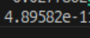
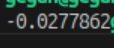

# Задание №1
## Сборка и запуск
```
mkdir build
cmake -B build -S .
cmake --build build
./build/Main float или ./build/Main double 
```

| Вывод double | Вывод float |
| :------------ | :----------- |
|  |  |